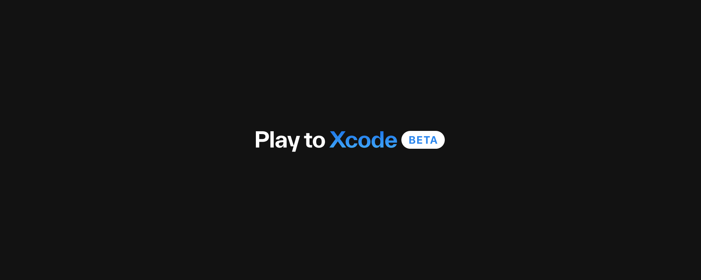

# PlaySDK


## PlaySDK Overview

The **PlaySDK** enables developers to export Play designs as production-ready code. Play generates highly performant native UIKit or SwiftUI code that integrates seamlessly with your existing projects and can be safely shipped to production. The PlaySDK makes all of your Play styles, components, assets, views, and pages accessible inside Xcode.  

With **Play + PlaySDK**, anyone can design and build apps inside the Play app, export their work, integrate it into their existing codebase, and ship it to the App Store.  

**Check out this guide on getting started with PlaySDK:**  
https://www.youtube.com/watch?v=JJ0kQthYDvU

### What is Play?

**Play** is a visual platform for designing interactive iOS apps. It allows you to use real iOS views to build and prototype your ideas and see them live on your device.  
[You can download Play here.](https://createwithplay.com/)

## Requirements

- Currently, this SDK supports a minimum iOS version of **17.4+**.
- The SDK is tested and developed using Xcode **16.2**.
- The package uses Swift Tools Version **5.8** and does not yet support Swift 6.

## Getting started

The library is distributed through Swift Package Manager

To get started with PlaySDK, check out the following resources:

- [Getting Started with PlaySDK](https://createwithplay.com/playsdk/getting-started)

### Quick Start with Our Example Project

To quickly see how PlaySDK works and how it can be embedded into an iOS app, check out the **example project** included in the repository. This project demonstrates how to integrate Play components and pages into an Xcode project.

1. Clone the PlaySDK repository.  
2. Open the `Examples/` folder.  
3. Run the example project in Xcode to explore PlaySDK in action.  

This example provides a hands-on look at how PlaySDK translates Play designs into a functional iOS app.

You can get started with PlaySDK without having previously installing or using the Play application, though installing it may be useful for opening Play files before exporting them. [You can download Play on our website.](https://createwithplay.com/)

### How Do I Import My Play Project into My Existing App?

During the export process, Play gives you the option to add your project to an existing app. Simply hit **Publish**, then **Export New Project**, and instead of creating a new project, select an existing Xcode project. Play will automatically add the necessary packages and entitlements to your existing project.

For detailed export steps, check out this guide:  
[Exporting Play Projects to Xcode](https://learn.createwithplay.com/en/articles/10752714-play-to-xcode)

#### Using a Play Component in Your Existing Application

##### SwiftUI

You can instantiate a component in your existing application by importing your package.

```swift
var body: some View {
    VStack(spacing: 16) {
        
        // Add the component from PlaySDK
        Chip()
        
        // Set the Component's state (this component has 2 states: 'defaultState' & 'selected')
            .state(currentState)
        
        // Do something when the state changes
        // Tap the button to change its state
            .onStateChange { state in
                currentState = state
                withAnimation() { isToggled.toggle() }
            }
    }
}
```

##### UIKit

```swift
override func viewDidLoad() {
  super.viewDidLoad()
  // Add the component from PlaySDK
  let myComponent = Chip()
  myComponent.translatesAutoresizingMaskIntoConstraints = false
  view.addSubview(myComponent)
  
  NSLayoutConstraint.activate([
      myComponent.centerXAnchor.constraint(equalTo: view.centerXAnchor),
      myComponent.centerYAnchor.constraint(equalTo: view.centerYAnchor)
  ])
  
  // Set the Component's state (this component has 2 states: 'defaultState' & 'selected')
  myComponent.state(.selected)
  
  // Do something when the state changes
  // Tap the button to change its state.
  myComponent.onStateChange = { [weak self] animation in
      self?.isToggled.toggle()
      changeBackgroundColor()
  }
}
```

Check out the `Examples/` folder and the [Implementing Play's SDK in Xcode Guide](https://learn.createwithplay.com/en/articles/10751622-implementing-play-s-sdk-in-xcode) for more examples of how to work with PlaySDK.

---

## Explore More Play Projects

Discover our **gallery of projects** inside the Play app to see what can be built with Play and PlaySDK.  
[Download Play](https://createwithplay.com/) to explore these projects in action.

🌤️ We just launched **Lume**, a full app built entirely with Play and PlaySDK—without writing a single line of code! Check it out on the App Store.

---

## Helpful Links

📘 [Play Docs](https://createwithplay.com/docs)  
🛠 [Play Forums](https://createwithplay.com/community/forums/home)  

---

## Issues

Have an issue with PlaySDK or a feature request? Log it in our [GitHub Issues](https://github.com/CreateWithPlayApp/PlaySDK/issues) tab! You can also browse older issues and discussions for solutions to common problems.
